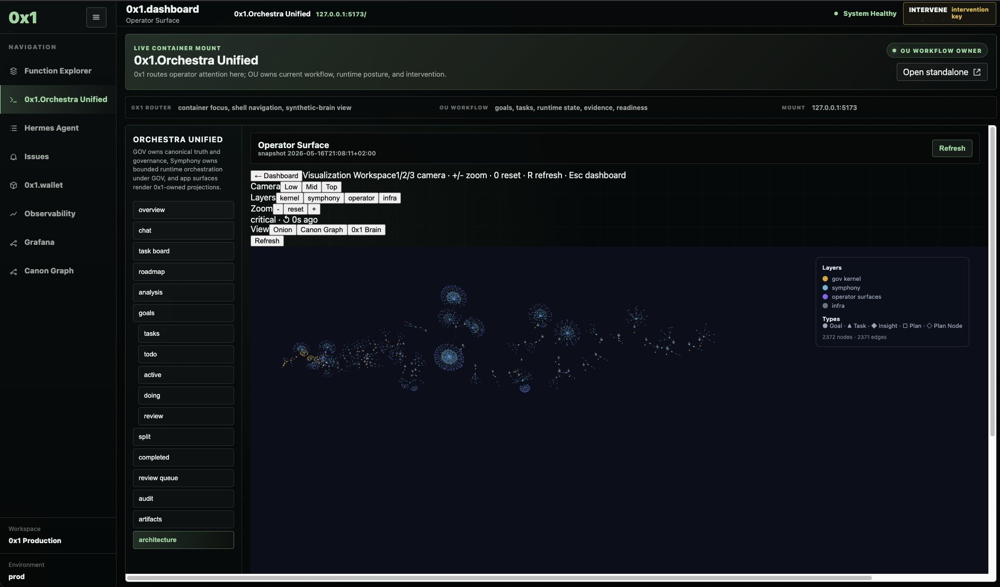

# 0x1 — Orchestra Unified

> **AI-governed work orchestration platform.** Private source, public showcase.

## What it is

0x1 is a system for orchestrating AI agents across cloud and local infrastructure —
managing their work, verifying their output, and maintaining a tamper-evident
audit trail of every action taken. Think of it as a project management and
governance system for AI-driven work.

The platform introduces **AI-governed work**: every task an agent performs is
tracked, evidence-verified, and chained to a tamper-evident audit log. Work can
be validated, reviewed, and integrated — or rejected and repaired — without human
intervention at every step.

## By the numbers

| Metric | Value |
|---|---|
| Python modules | 6,400+ |
| Git commits | 14,310 |
| Test files | 1,359 |
| Hash-chain blocks | 475 |
| Total audit events | ~299,000 |
| Development goals managed | 201 |
| Tasks tracked | 3,383 |
| Audit problems | 0 |

## Screenshots

### Dashboard — live graph visualization

The operator surface shows a live visualization of the system's internal graph:
2,372 nodes and 2,371 edges representing goals, tasks, insights, and plan nodes
across multiple layers. The left panel shows the task board workflow
(overview → active → doing → review → completed). The system renders
real-time projections of the canonical state.

## What it does

- **Agent orchestration** — dispatches work to AI agents across cloud and local
  infrastructure, tracks progress, and verifies results
- **Evidence-based verification** — every completed task must produce verifiable
  evidence; fabricated evidence is detected and rejected
- **Tamper-evident audit trail** — all state changes are hash-chained and
  sealed into checkpoint blocks, creating an immutable record of every action
- **Automated quality gates** — work passes through validation pipelines before
  it can be marked complete
- **Multi-node synchronisation** — runs across macOS and Linux nodes over a
  private mesh network

## Hardware

Local execution runs on AMD Strix Halo with 128 GB unified memory, supporting
parallel inference of large language models. The local execution layer is
currently being bootstrapped, with the goal of 100% local responsibility.

## Technologies

- **Language:** Python (6,400+ modules)
- **Inference:** Local LLM inference via custom gateway
- **Audit:** Custom hash-chain implementation (append-only, self-healing)
- **Network:** Multi-node sync over private mesh
- **Hardware:** AMD Strix Halo (128 GB unified memory)

## Repository access

The source code is private. Access is available on request for:
- Potential employers and internship reviewers
- Commercial partners and clients
- Collaborators

Contact: andre.hamm1@gmx.de

## License

Proprietary. All rights reserved.
